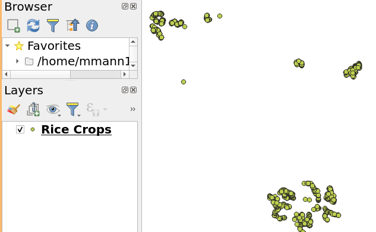

# Introduction to Python in QGIS

Welcome to our tutorial on using Python with QGIS! QGIS is a powerful open-source geographic information system (GIS) that supports various GIS operations and spatial data management. One of the fantastic features of QGIS is its built-in Python console, which allows you to enhance your GIS projects with programming.

QGIS brings a Python API (see [PyQGIS Developer Cookbook](https://docs.qgis.org/latest/en/docs/pyqgis_developer_cookbook/) for some code samples) to let the user interact with its objects (layers, features, or interface). QGIS also has a Python console.

## *Table of contents*

1. [The Python Console in QGIS](#console)
2. [Python Modules](#modules)
3. [Using Python with QGIS](#using_qgis)
4. [Tutorial 1: Working with Crop Types in QGIS Python](#tutorial1)
5. [Tutorial 2: Counting Observations by Crop Type in QGIS](#tutorial2)
6. [Tutorial 3: Calculating Area of Polygons Using QGIS Python](#tutorial3)
7. [Challenge Question Answers](#answers)


---

## The Python Console in QGIS <a name="console"></a>

To get started with Python in QGIS, you first need to access the Python console. Here’s how you can do it:

1. **Open QGIS**: Start by launching the QGIS application on your computer.
2. **Open the Python Console**: Look for a button on the toolbar that resembles a Python logo or go to the menu bar and select `Plugins` -> `Python Console`. This will open a small scripting window at the bottom or side of your QGIS workspace.

The Python console in QGIS is split into two main parts:
- **The command line**: This is where you can type single lines of Python code and execute them immediately.
- **The editor**: Here, you can write more complex scripts, save them, and run them as needed.

This dual setup allows you to quickly test small pieces of code and develop more extensive scripts for automating tasks.

## QGIS Python Console

The console is a Python interpreter that allows you to execute Python commands. Modules from QGIS (analysis, core, gui, server, processing, 3d) and Qt (QtCore, QtGui, QtNetwork, QtWidgets, QtXml) as well as Python's math, os, re, and sys modules are already imported and can be used directly.

The interactive console is composed of a toolbar, an input area, and an output area.


### Toolbar

The toolbar proposes the following tools:
- Clear Console  to wipe the output area;

- Run Command  available in the input area: same as pressing Enter;

- Show Editor : toggles console editor visibility;

- Options... : opens a dialog to configure console properties;

- Help...  provides a menu to access various documentation:
  - [Python Console Help](https://docs.qgis.org/latest/en/docs/user_manual/plugins/python_console.html)
  - [PyQGIS API documentation](https://qgis.org/api/)
  - [PyQGIS Cookbook](https://docs.qgis.org/latest/en/docs/pyqgis_developer_cookbook/)

Dock Code Editor  to dock or undock the panel in QGIS interface.


## Why Use Python in QGIS?
Using Python in QGIS allows you to automate repetitive tasks, manipulate spatial data in ways that are cumbersome or impossible with the GUI alone, and extend the functionality of QGIS through custom scripts and plugins.

Throughout this tutorial, we will explore simple Python commands and scripts that you can execute in the Python console to interact with QGIS and perform basic GIS operations. These activities are designed to be fun and engaging, providing you with a hands-on introduction to programming within a GIS environment.

Let’s get started with some basic commands to familiarize you with the Python console in QGIS!

---

## Introduction to Python Modules <a name="modules"></a>

In Python, a module is a file containing Python code that defines functions, classes, or variables, which can be accessed and utilized in other Python scripts. 

Python has a vast standard library of modules that you can use for various tasks, from mathematical operations to handling internet data. Additionally, third-party modules can be installed and used in your projects, greatly extending Python's capabilities.

### Importing Modules in Python

To use a module in Python, you need to import it into your script using the `import` statement. Once a module is imported, you can call its functions or access its classes and variables using the dot notation.

For example, to import the Python `math` module, you would write:

```python
import math
```

Now you can use functions within the `math` module:

```python
result = math.sqrt(25)  # Computes the square root of 25
print(result)
```

Paste these lines into the Python console in QGIS to see the output and press 

### Using Python with QGIS <a name="using_qgis"></a>

QGIS extends Python’s capabilities by providing a specialized module called `qgis`. This module allows you to interact with the QGIS application, manipulating geographical data and automating tasks.

To start scripting with Python in QGIS, you'll first need to import the necessary modules provided by QGIS. These typically include:

- `qgis.core`: Provides core functionality like managing and manipulating vector and raster layers.
- `qgis.utils`: Contains utility functions for interacting with the QGIS interface.
- `iface`: A special variable from the `qgis.utils` module representing the QGIS interface, allowing you to interact with the application itself, like opening and displaying layers.

Here’s how to import these modules into your QGIS Python script:

```python
from qgis.core import *
import qgis.utils
```

With these imports, you’re now ready to use the QGIS Python API to enhance your GIS projects with automated scripts and customized functionality!

---

## Tutorial 1: Working with Crop Types in QGIS Python <a name="tutorial1"></a>

In this part of our tutorial, we'll learn how to read a GeoJSON file that contains various crop types, subset the data for rice crops, and then write the results to a new file. We will also explore a variant where you'll learn to write the results to a Shapefile instead by reading the QGIS API documentation.

### Step 1: Reading the GeoJSON File

First, we need to load our GeoJSON file into QGIS. We'll use the `iface` object, which is a part of the QGIS Python API that represents the main interface of QGIS.

```python
from qgis.core import *
import qgis.utils

# Path to the GeoJSON file
file_path = 'path_to_your_file/tz_labels.geojson'

# Load the layer in 
rice_layer = iface.addVectorLayer(file_path,   # path to the file
                                 baseName= "Rice Crops",  # name of the layer in QGIS
                                 providerKey="ogr") # how to read it
if not rice_layer:
    print("Layer failed to load!")
else:
    print("Layer loaded successfully!")
```

Paste these lines into the Python console in QGIS to see the output and press 

You should now see `Rice Crops` in your QGIS Layers Panel. This layer contains the crop types data from the GeoJSON file.



From this point on we will be refering this layer by the name `rice_layer` in our code.

<br>

>  *Where do I find the path to my file?*  

In order to load a file into python you will need to find the 'path' to the `tz_labels.geojson` file.  Start by `Layer` > `Add Layer` > `Add Vector Layer`. Then in your layers list `right-click` on `tz_labels` and select `Properties`.  In the `General` tab you will find the `Layer Source` which is the path to your file.  Copy and paste this path into the `file_path` variable in the code above.


*Make sure your path doesn't include ``'file://'`` at the beginning.*


### Step 2: Subsetting the Data for Maize Crops

Next, we'll filter out the rice crops from our dataset. We'll assume that the crop types are stored in a field named `crop_type`.

```python
# Select features where the crop type is 'Rice'
rice_layer.selectByExpression("\"primary_crop\" = 'maize'")
# Print the number of selected rows
print(f"Number of selected rows: {rice_layer.selectedFeatureCount()}")
```

Paste these lines into the Python console in QGIS to see the output and press 

> **Note:**
For more on how to create expressions in Qgis see [Select Expressions](https://mmann1123.github.io/YM_Conference_Thailand/select_expressions.html)


### Step 3: Writing the Subset to a New GeoJSON File

After subsetting the data, let's write the selected features to a new GeoJSON file.

```python
# Define the output file path
output_path = 'path_to_output/rice_subset.geojson'

# Write the selected features to a new GeoJSON
error = QgsVectorFileWriter.writeAsVectorFormat(layer = rice_layer, 
                    fileName = output_path, # path and name of the output file
                    fileEncoding = "UTF-8", # encoding of the output file
                    destCRS = rice_layer.crs(),  # projection of the output file
                    driverName ="GeoJSON", # output file format
                    onlySelected=True) # write only selected features

if error[0] == QgsVectorFileWriter.NoError:
    print("Success: GeoJSON file has been created.")
else:
    print("Error: Failed to write GeoJSON.")
```

Your `output_path` should be a new file in the same directory as the original file. You can now load this new file into QGIS to see the subset of rice crops.

---
#### Full Script
The following is the full script that you can run in the QGIS Python console to read a GeoJSON file, subset the data for rice crops, and write the results to a new file.

```python
from qgis.core import *
import qgis.utils

# Path to the GeoJSON file
file_path = 'path_to_your_file/tz_labels.geojson'

# Load the layer in
rice_layer = iface.addVectorLayer(file_path,   # path to the file
                                 baseName= "Rice Crops",  # name of the layer in QGIS
                                 providerKey="ogr") # how to read it
if not rice_layer:
    print("Layer failed to load!")
else:
    print("Layer loaded successfully!")

# Select features where the crop type is 'Rice'
rice_layer.selectByExpression("\"primary_crop\" = 'maize'")
# Print the number of selected rows
print(f"Number of selected rows: {rice_layer.selectedFeatureCount()}")


# Define the output file path
output_path = 'path_to_output/rice_subset.geojson'

# Write the selected features to a new GeoJSON
error = QgsVectorFileWriter.writeAsVectorFormat(layer = rice_layer, 
                    fileName = output_path, # path and name of the output file
                    fileEncoding = "UTF-8", # encoding of the output file
                    destCRS = rice_layer.crs(),  # projection of the output file
                    driverName ="GeoJSON", # output file format
                    onlySelected=True) # write only selected features

if error[0] == QgsVectorFileWriter.NoError:
    print("Success: GeoJSON file has been created.")
else:
    print("Error: Failed to write GeoJSON.")
```

---
#### Challenge A: Import your file

Now that you've created a new GeoJSON file with the subset of rice crops, try loading it into QGIS and exploring the data using `output_path` and `iface.addVectorLayer()`

#### Challenge B: Writing to a Shapefile

If you want to write the output to a Shapefile instead, you'll need to consult the QGIS API documentation to learn about the parameters required for writing a Shapefile. Here's how you might start:

1. Open the QGIS Python API documentation: [QGIS Cook Book](https://docs.qgis.org/3.34/en/docs/pyqgis_developer_cookbook/vector.html#creating-vector-layers)
2. Search for `QgsVectorFileWriter` and read about the different parameters you can use, especially how to specify the output format for a Shapefile.

Here’s a hint on how you might adjust the code for writing a Shapefile:

```python
# Define the output file path for the Shapefile
output_path_shp = 'path_to_output/rice_subset.shp'

error = QgsVectorFileWriter.writeAsVectorFormat(layer = rice_layer, 
                    fileName = output_path_shp, # path and name of the output file
                    fileEncoding = "UTF-8", # encoding of the output file
                    destCRS = rice_layer.crs(),  # projection of the output file
                    driverName = __________________, # output file format
                    onlySelected=True) # write only selected features

if error_shp[0] == QgsVectorFileWriter.NoError:
    print("Success: Shapefile has been created.")
else:
    print("Error: Failed to write Shapefile.")

```

### Summary Tutorial 1

In this tutorial, we learned how to use Python in QGIS to read a GeoJSON file, subset the data for rice crops, and write the results to a new file. We also explored how to write the output to a Shapefile by consulting the QGIS API documentation.

---
---

## Tutorial 2: Counting Observations by Crop Type in QGIS <a name="tutorial2"></a>

In this tutorial, we will learn how to load a vector layer into QGIS, access its attribute data, and perform a basic analysis by counting the number of observations for each crop type using the `primary_crop` field from the `tz_labels.geojson` dataset.

### Step 1: Load the Vector Layer

First, let’s load the `tz_labels.geojson` into QGIS. Open the Python console in QGIS and use the following command to add the layer:

```python
# Load the tz_labels.geojson file
layer_path = "/path/to/tz_labels.geojson"  # Update this path to your file's location
tz_labels_layer = iface.addVectorLayer(layer_path, "TZ Labels", "ogr")
if not tz_labels_layer:
    print("Failed to load the layer.")
else:
    print("Layer loaded successfully.")
```

### Using Dictionaries to Count Items in Python

In Python, a dictionary is a collection of key-value pairs where each key is unique. This structure is ideal for counting occurrences of items because you can use the item as the key and its count as the value.

#### Basic Example of Counting with Dictionaries

Let’s look at a simple example using a list of fruits to illustrate how we can use a dictionary to count occurrences.

1) *List of Fruits*: We start with a list of fruits where some fruits may appear multiple times.

```python
# List of fruits
fruits = ['apple', 'banana', 'orange', 'apple', 'orange', 'banana', 'orange']
```

2) *Initialize the Dictionary*: We start with an empty dictionary `fruit_counts` where each fruit name will be a key, and the count of that fruit will be the corresponding value.

``` python 
# Initialize a dictionary to hold the count of each fruit
fruit_counts = {}
```

3) *Iterate Through the List*: We loop through each element in the `fruits` list.

4) *Update the Dictionary*: As we move through the elements of `fruits` list, we update the `fruit_counts` dictionary:
   - If the fruit is already a key in the dictionary (`if fruit in fruit_counts`), we increase its count by 1.
   - If the fruit is not yet a new `fruit` key in the dictionary, we add it and set its count to 1.

``` python
# Iterate over the list of fruits
for fruit in fruits:
    if fruit in fruit_counts:
        fruit_counts[fruit] += 1  # Increment the count if the fruit is already in the dictionary
    else:
        fruit_counts[fruit] = 1  # Set the count to 1 if the fruit is not in the dictionary yet
```

5) *Print the Results*: After the loop, we print each fruit and its count. The `items()` method returns a list of tuple pairs (key, value) from the dictionary.

``` python
# Print the counts for each fruit
for fruit, count in fruit_counts.items():
    print(f"{fruit}: {count}")
```

**Output**:
The following is the output of the code snippet above:

```python
apple: 2
banana: 2
orange: 3
```
 
### Step 2: Applying This to QGIS Data

We can apply the same technique to count crop types from a feature layer in QGIS. Here’s how it connects to our GIS data example:

```python
# Suppose we have a layer loaded as tz_labels_layer and it contains a field 'primary_crop'

# Initialize a dictionary to hold the count of each crop type
crop_counts = {}

# Access the features (rows) in the layer
for feature in tz_labels_layer.getFeatures():
    # Get the value of the 'primary_crop' field
    crop_type = feature['primary_crop']
    
    # Use the dictionary counting method
    if crop_type in crop_counts:
        crop_counts[crop_type] += 1
    else:
        crop_counts[crop_type] = 1

# Print the counts for each crop type
for crop, count in crop_counts.items():
    print(f"{crop}: {count}")
```

Your output should be as follows:

``` bash
maize: 403
rice: 280
soybeans: 10
sunflower: 278
peanuts: 13
fallow_barren: 1
cassava: 76
sorghum: 131
okra: 2
millet: 139
no: 5
cotton: 50
don_t_know: 2
large_building: 1
forest_shrubland: 2
could be maize.: 1
water_body: 1
water: 5
```

This method efficiently tracks the number of occurrences of each crop type, providing a quick summary of the data in your GIS layer. By leveraging Python dictionaries, you can easily extend this approach to count various attributes across different datasets in QGIS.

---

#### Challenge C: Count observations by field size

Our `tz_labels.geojson` dataset contains a field named `field_size` that represents the size of each field. Try adapting the code to count the number of observations for each field size category.

### Summary Tutorial 2 

This tutorial demonstrates a simple way to perform attribute data analysis directly within QGIS using Python. By counting the occurrences of different crop types, we can quickly assess the composition of agricultural data in the provided `tz_labels.geojson`. This process can be adapted to other datasets and attributes for various analytical needs.

 

---
---
  
**PLEASE CLEAR THE CONSOLE BEFORE MOVING ON TO THE NEXT TUTORIAL**
 

---
---

## Tutorial 3: Calculating Total Area of Polygons in Acres Using QGIS Python <a name="tutorial3"></a>

In this tutorial, we will learn how to load a polygon vector layer into QGIS, access its geometrical data, and calculate the total area of the polygons in acres. We will use the `sa_labels.geojson` dataset and focus on the field named 'crop_name'.

### Step 1: Load the Vector Layer

First, let's load the `sa_labels.geojson` file into your QGIS project. Make sure to open the Python Console within QGIS to run these commands:

```python
# Path to the sa_labels.geojson file
layer_path = "/path/to/sa_labels.geojson"  # Change this to the actual file path

# Load the layer into QGIS
sa_labels_layer = iface.addVectorLayer(layer_path, "SA Labels", "ogr")
if not sa_labels_layer:
    print("Failed to load the layer.")
else:
    print("Layer loaded successfully.")
```

### Step 2: Find the Linear Unit of the Layer

When working with geographic data, understanding the coordinate reference system (CRS) and its linear units is crucial because the measurement of areas, lengths, and other spatial calculations depends on these units. 

In QGIS, each projected layer has a CRS, which defines how the two-dimensional, flat map in QGIS relates to real places on the earth. The CRS includes the type of projection and the units used for the linear measurements, which could be meters, feet, or any other units. 

These units are important as they directly affect how measurements like area and distance are calculated and interpreted.

#### How to Find the Linear Unit of the Projection

To determine the linear unit of the projection for a layer in QGIS, you can inspect the layer’s CRS. Here’s how you can do this using the Python console in QGIS:

```python
# Assuming 'sa_labels_layer' is the layer you've loaded
crs = sa_labels_layer.crs()

# Print the CRS description
print(f"Unit name: {crs.description()}")

# Print the Proj4 string with linear unit
print(f"Proj4 description: {crs.toProj()}")
```
Here the Proj4 string will contain the linear unit of the projection. For example, if the unit is in meters, you will see `+units=m` in the Proj4 string.

### Step 2: Calculating Total Area

Once the layer is loaded, we can calculate the total area of the polygons. Since the area will be calculated in the layer's coordinate reference system units, we need to convert these units to acres. The conversion factor from square meters to acres is approximately 0.000247105.

In order to calculate the total area in acres, we will iterate through each feature in the layer, retrieve its geometry, and sum the areas (measured in $m^2$) of the polygons in a variable called `total_area_sqm`.

Here's how you can do this in QGIS Python:

```python
# Initialize a variable to hold the total area in square meters
total_area_sqm = 0

# Iterate through each feature in the layer
for feature in sa_labels_layer.getFeatures():
    # Get the geometry of the feature
    geom = feature.geometry()
    
    # Add the area of the geometry to the total area
    total_area_sqm += geom.area()

# Convert square meters to acres (1 square meter = 0.000247105 acres)
total_area_acres = total_area_sqm * 0.000247105

# Print the total area in acres
print(f"Total area of crops: {total_area_acres:.2f} acres")
```

---

### Challenge D: Calculate the total area of each crop type

Extend the code to calculate the total area of each crop type in the `sa_labels.geojson` dataset. You can use a dictionary to store the total area for each crop type.

Let me help you get started, here is a snippet of code that you can use to calculate the total area of each crop type:

```python
# Initialize a dictionary to hold the total area for each crop type
area_by_crop = {}

# Iterate through each feature in the layer
for feature in sa_labels_layer.getFeatures():
    crop_type = feature['crop_name']  # Adjust the field name if different
    area_sqm = feature.geometry().area()  # Area in the CRS's units (e.g., square meters)

    
    # Convert the area to acres
    
    # Update the area_by_crop dictionary for the crop type

# Print the total area for each crop type
for crop, area in area_by_crop.items():
    print(f"{crop}: {area:.2f} acres")
```

### Summary Tutorial 3

This tutorial provides you with a basic understanding of how to work with polygon geometries in QGIS using Python, specifically focusing on calculating areas and converting these areas into different units. Such skills are valuable for a wide range of GIS and environmental analysis tasks.


## Challenge Question Answers <a name="answers"></a>

> The answers to the challenge questions can be found in the [Challenge Solutions](https://mmann1123.github.io/YM_Conference_Thailand/challenge_solutions.html) page.